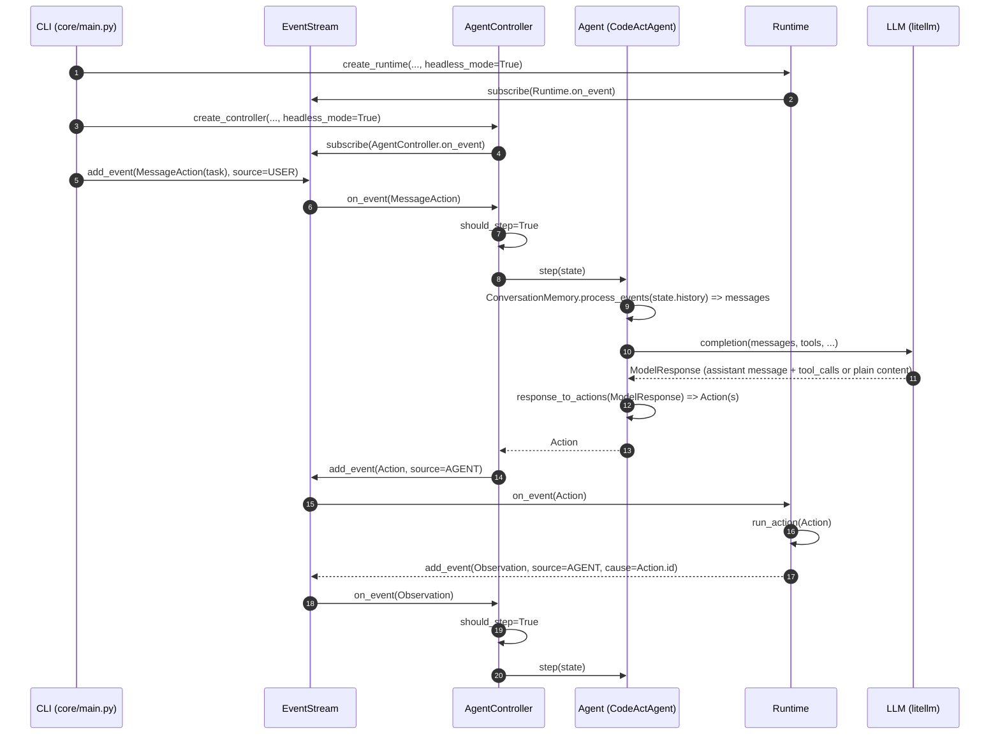

# OpenHands V0（无头模式）Agent 调用全流程

本文聚焦 OpenHands **V0（Legacy-V0）** 的 **无头（headless）模式**：即通过命令行直接运行 agent（不经 Web UI / App Server），从入口到 Agent 主循环、消息封装、tool call/response 的生成与落盘轨迹的结构。

不覆盖 V1（Software Agent SDK / app_server）路径。

## 目标读者与常见困惑

你可能会遇到这些现象：

- “我看到模型返回了 tool_calls，但轨迹里没看到 `role=tool`。”
- “tool 的 response 到底记录在哪里？为什么只有 action/observation？”
- “User/Assistant 的 message 是怎么拼到 LLM request 的？”

答案核心是：**V0 的一等公民不是 chat message，而是 Event（Action/Observation）**。发送给 LLM 的 `role=tool` 消息是 **在组装 prompt 时从 Observation 临时生成** 的，不一定会以 message 的形式落到 trajectory。

---

## 1. 无头模式入口：从 CLI 到 run_controller

无头模式的主入口是 [openhands/core/main.py](../openhands/core/main.py)。

关键流程：

1. CLI 参数解析与配置加载
	 - [openhands/core/config/utils.py](../openhands/core/config/utils.py)：`parse_arguments()`、`setup_config_from_args()`
2. 读取任务（task）并封装为初始 Action
	 - [openhands/core/main.py](../openhands/core/main.py)：构造 `MessageAction(content=task_str)`
3. 进入 `run_controller(...)`
	 - [openhands/core/main.py](../openhands/core/main.py)：`async def run_controller(...)`

在无头模式下，为了避免 agent 卡在 “等待用户输入”，默认会启用自动回复：

- [openhands/core/main.py](../openhands/core/main.py)：`auto_continue_response(...)`
- 该函数会返回 “不要问人类、继续执行、能结束就 finish” 的提示。

这就是无头模式与交互模式最大的行为差异之一：**无头模式会持续向 EventStream 注入“伪用户消息”，推动循环前进**。

---

## 2. V0 的核心架构：EventStream 驱动，而不是消息驱动

V0 的数据流基本围绕以下组件协作：

- **EventStream**：事件总线 + 落盘日志
	- [openhands/events/stream.py](../openhands/events/stream.py)
- **AgentController**：订阅 EventStream，维护 State，驱动 agent step
	- [openhands/controller/agent_controller.py](../openhands/controller/agent_controller.py)
- **Agent（默认 CodeActAgent）**：把历史 Events 转成 LLM messages，调用 LLM，解析为 Actions
	- [openhands/agenthub/codeact_agent/codeact_agent.py](../openhands/agenthub/codeact_agent/codeact_agent.py)
- **Runtime**：执行 runnable actions（bash/file/ipython/browser/...），产出 Observations
	- [openhands/runtime/base.py](../openhands/runtime/base.py)
- **Memory**：负责 microagent / workspace context 等 recall；也订阅 EventStream
	- [openhands/memory/memory.py](../openhands/memory/memory.py)

用一句话概括：

> **EventStream 里不断追加 Action/Observation，AgentController 看到“该轮需要 step”时，就调用 Agent.step() 生成下一条 Action；Runtime 执行 Action 生成 Observation；再回到 EventStream。**

---

## 3. 端到端时序（无头模式）

下面的 Mermaid 图把 V0 无头模式一次完整循环串起来（“消息”只在 LLM 调用时临时存在）：

注意：

- “`role=tool`” 不是 EventStream 的事件类型，它是 **LLM messages** 里的 role。
- EventStream 记录的是：`MessageAction`（用户输入/agent 输出）、各种 runnable `Action`、以及对应的 `Observation`。

---

## 4. Message 是怎么封装与序列化的（OpenHands -> LLM）

### 4.1 Message 结构

V0 的 LLM 消息结构定义在 [openhands/core/message.py](../openhands/core/message.py)：

- `Message.role`: `system | user | assistant | tool`
- `Message.content`: 由 `TextContent` / `ImageContent` 组成的列表
- `Message.tool_calls`: assistant 发起工具调用时携带（来自模型响应）
- `Message.tool_call_id + name`: tool 角色的“工具执行结果”消息携带（发回给模型）
- `Message.reasoning`: **仅用于记录/调试**，不发送给 LLM（字段注释明确说明）

序列化逻辑：

- `Message.serialize_model()` 会在 “vision / prompt caching / function calling” 条件下走 list-serializer，否则走 string-serializer。
- `_add_tool_call_keys()` 会把 `tool_calls` 和 `tool_call_id/name` 挂进最终的 OpenAI-compatible payload。

### 4.2 从 Event 组装成 messages：ConversationMemory

CodeActAgent 在每次调用 LLM 之前，会把 State 的历史事件（Action/Observation）变成 messages：

- [openhands/agenthub/codeact_agent/codeact_agent.py](../openhands/agenthub/codeact_agent/codeact_agent.py)：`_get_messages(...)`
- [openhands/memory/conversation_memory.py](../openhands/memory/conversation_memory.py)：`ConversationMemory.process_events(...)`

这一层做了几件非常关键的事：

1. **保证对话以 system + 初始 user message 开头**
2. 将不同类型的 Action/Observation 转成 LLM 可理解的 `Message(role=...)`
3. **在 function-calling 场景下，维护“tool_calls 与 tool responses 的配对与顺序”**

也就是你要找的：“User 的 message 是怎么封装的、Assistant 的 message 是怎么封装的”。在 V0 里：

- 用户输入：通常是 EventStream 里的 `MessageAction(source=USER)`，最终映射为 `Message(role='user')`。
- assistant 自然语言输出：通常是 `MessageAction(source=AGENT)` 或（某些 action）携带的 `thought`，最终映射为 `Message(role='assistant')`。

---

## 5. Tool call/response 是怎么处理的（V0 的关键）

### 5.1 模型 tool_calls -> OpenHands Action（解析层）

当模型返回 `assistant.tool_calls` 时，CodeActAgent 会走 function-calling 解析：

- [openhands/agenthub/codeact_agent/function_calling.py](../openhands/agenthub/codeact_agent/function_calling.py)：`response_to_actions(...)`

核心行为：

1. 遍历 `assistant_msg.tool_calls`
2. 每个 tool_call 映射成一个 OpenHands `Action`（例如 `CmdRunAction` / `FileEditAction` / `TaskTrackingAction` 等）
3. 给每个 action 绑定 `ToolCallMetadata`：
	 - `tool_call_id`: 对应 `tool_call.id`
	 - `function_name`: 对应 `tool_call.function.name`
	 - `model_response`: **整份** `ModelResponse`（用于轨迹复盘/调试）
	 - `total_calls_in_response`: 同一个 assistant turn 里 tool_calls 的数量

`ToolCallMetadata` 定义在 [openhands/events/tool.py](../openhands/events/tool.py)。

另外，这一层还会尝试把 provider 的 reasoning 字段提取出来并塞到 action 或 message：

- tool_calls 分支：把 reasoning + content 合并为 `thought`（只加到第一个 action）
- 非 tool_calls 分支：生成 `MessageAction(wait_for_response=True, reasoning=...)`

### 5.2 OpenHands Action -> Runtime 执行 -> Observation（执行层）

Action 进入 EventStream 后，Runtime 订阅回调会执行 runnable actions：

- [openhands/runtime/base.py](../openhands/runtime/base.py)：`Runtime.on_event(...)` -> `_handle_action(...)`

执行完成后，Runtime 会把 observation 回写到 EventStream，并且做两件“串联 tool call/response 的关键动作”：

1. `observation._cause = action.id`（把 observation 指向触发它的 action）
2. `observation.tool_call_metadata = action.tool_call_metadata`（把 tool_call_id/function_name/model_response 一并带上）

所以，在 V0 的 event/trajectory 视角里：

> **tool response = Observation.content + Observation.tool_call_metadata（以及 cause）**

### 5.3 Observation -> Message(role='tool')（回填到下一轮 prompt 的组装层）

你之所以“看不到 role tool”，是因为它只在“组装下一次 LLM messages”时产生：

- [openhands/memory/conversation_memory.py](../openhands/memory/conversation_memory.py)：`_process_observation(...)`

逻辑是：

- 对于任意 observation，如果 `obs.tool_call_metadata` 存在，则构造：
	- `Message(role='tool', tool_call_id=..., name=function_name, content=...)`
	- 先放入 `tool_call_id_to_message`，暂不返回
- 然后在 `process_events(...)` 里，当发现某个“发起 tool_calls 的 assistant message”所需的 tool responses 都齐了，就按顺序 append：
	1) assistant message（带 tool_calls）
	2) tool message(s)（tool_call_id 对齐）

这解释了两个关键现象：

1. `role=tool` **确实存在**，但它属于 “LLM prompt messages”，不是 EventStream 的事件类型。
2. tool response **一定会落在轨迹里**（Observation 事件），但不一定以 `role=tool` 这种“消息形态”出现。

---

## 6. 为什么轨迹里看不到 “tool role / tool response message”

### 6.1 轨迹（trajectory）记录的是 Events，不是 LLM messages

V0 的 EventStream 会把每个 event 单独落盘：

- [openhands/events/stream.py](../openhands/events/stream.py)：`EventStream.add_event(...)`

你在 trajectory/json 里看到的通常是：

- `MessageAction`（用户/agent的自然语言）
- runnable `Action`（bash/file/ipython/...）
- `Observation`（命令输出、文件内容、错误等）

这些 event 里会携带 `tool_call_metadata`，但 **不会把“最终送给 LLM 的 messages 列表”整体写进去**。

### 6.2 想看 “真实发送给 LLM 的 messages（含 role tool）”怎么办？

有两条路：

1. 使用请求 dump（每次 completion 的 payload）
	 - [openhands/llm/llm.py](../openhands/llm/llm.py)：支持 `OPENHANDS_DUMP_REQUEST=1` 和 `OPENHANDS_DUMP_REQUEST_DIR=...`
2. 使用 context snapshot（把 prompt 也落盘）
	 - CodeActAgent 可保存 “格式化后的 messages” 到 snapshot
	 - 参考现有文档 [docs/context-snapshots-v0.md](context-snapshots-v0.md)

此外，如果你在轨迹里看到 tool 输出被写成 `"omitted"`，那通常是 condenser/context 策略在做工具输出的裁剪/丢弃：

- [openhands/agenthub/codeact_agent/codeact_agent.py](../openhands/agenthub/codeact_agent/codeact_agent.py)：context 策略与 discard_all 判断

---

## 7. “native tool calling” 与 “mock tool calling”（以及 role tool 的差异来源）

LLM 层（V0）有两种工具调用路径：

1. **原生 function calling（native）**：模型支持 tool_calls
	 - payload 里带 `tools`（schema）
	 - 返回 `assistant.tool_calls`
2. **提示词模拟（mock）**：模型不支持 tool_calls
	 - LLM 层会把 tools 注入到 prompt，并用 stop words 控制输出
	 - 然后再把“模型输出文本”转换回 tool_calls

对应实现：

- [openhands/llm/llm.py](../openhands/llm/llm.py)：
	- `mock_function_calling = not self.is_function_calling_active()`
	- `convert_fncall_messages_to_non_fncall_messages(...)`
	- `convert_non_fncall_messages_to_fncall_messages(...)`
- 相关转换器在 [openhands/llm/fn_call_converter.py](../openhands/llm/fn_call_converter.py)

因此，“你在某些情况下看到 role tool / tool response 的形态不同”，往往不是 agent 层逻辑变了，而是：

- 模型/路由是否支持 function calling
- 是否发生了 mock 转换
- condenser 是否裁剪/丢弃了旧的 tool 输出

---

## 8. Headless 模式特有差异点（相对 UI/交互模式）

### 8.1 自动继续（避免等待用户输入）

- [openhands/core/main.py](../openhands/core/main.py)：`auto_continue_response(...)`
- `run_controller(..., fake_user_response_fn=auto_continue_response)`

当 agent 进入 `AgentState.AWAITING_USER_INPUT` 时，`on_event(...)` 会自动注入一个 `MessageAction`，让 agent 继续。

### 8.2 Runtime 插件：headless 会禁用 VSCode 插件

- [openhands/runtime/base.py](../openhands/runtime/base.py)：如果 `headless_mode=True`，不会自动追加 `VSCodeRequirement()` 插件。

这会影响是否支持某些 VSCode 相关能力，但不影响 tool_calls 的机制本身。

### 8.3 stuck detection 在 headless_mode 下判定不同

- [openhands/controller/agent_controller.py](../openhands/controller/agent_controller.py)：构造 `AgentController(..., headless_mode=True)`
- headless_mode 会影响 stuck detector / control flags 的某些策略（例如是否把 user message 视为“打断循环”的证据）。

---

## 9. 调试与复盘：你该看哪些文件/字段

### 9.1 想复盘“这一次 LLM 调用到底发了什么？”

优先看请求 dump：

- [openhands/llm/llm.py](../openhands/llm/llm.py)：`OPENHANDS_DUMP_REQUEST=1`

它会写出 openai-compatible JSON，其中会包含：

- `messages`（含 `role=tool`）
- `tools` / `tool_choice`
- `extra_body`

### 9.2 想复盘“工具输出在哪里？”

在轨迹（Events）里看：

- `Observation.content`
- `Observation.cause`（对应哪个 Action）
- `Observation.tool_call_metadata.tool_call_id` / `function_name`

Runtime 会把 Action 的 `tool_call_metadata` 原样复制给 Observation。

### 9.3 想复盘“模型原始返回里有没有 reasoning_content？”

启用 raw response capture：

- [openhands/llm/llm.py](../openhands/llm/llm.py)：`OPENHANDS_CAPTURE_RAW_RESPONSE=1`
- 同时默认会尝试保留 reasoning 字段：`OPENHANDS_PRESERVE_REASONING_FIELD`（默认 true）

注意：如果上游 provider 在该请求形态下本来就返回 `reasoning_content: null`，那 OpenHands 不可能“凭空制造 reasoning”。

---

## 10. 小结：你观察到的现象在 V0 里的“正确解释”

- V0 的事实数据结构是 **Event（Action/Observation）**，不是 chat messages。
- `role=tool` 只在 “组装下一轮 LLM messages” 时由 Observation 临时生成。
- 轨迹里“看不到 tool message”是正常的，因为轨迹记录的是 observation，而不是 LLM payload。
- 真正的 tool response 一定存在于 Observation（含 `tool_call_metadata` 与 `cause`）。
- 想看 `role=tool`：用请求 dump 或 context snapshot（见 [docs/context-snapshots-v0.md](context-snapshots-v0.md)）。

